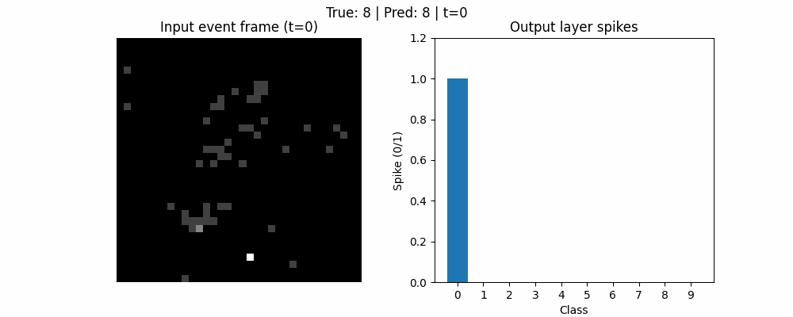

# Spiking Neural Network on N-MNIST
This repository contains an implementation of a **convolutional spiking neural network (SNN)** trained on the **N-MNIST** event-based vision dataset. The project explores supervised learning with **Leaky Integrate-and-Fire (LIF)** neurons using **surrogate-gradient backpropagation**.

The notebook covers event preprocessing, neuromorphic visualisations, model definition, training, and evaluation.

---

## Overview

Event-based cameras produce asynchronous streams of sparse events rather than conventional image frames. In this project, raw N-MNIST event streams are converted into **temporal frames** and processed sequentially by a spiking neural network.

Key goals:
- Implement an end-to-end **spiking vision pipeline**
- Understand the impact of temporal processing in SNNs
- Apply supervised learning to event-based data using biologically inspired neuron models

---

## Dataset: N-MNIST

N-MNIST is an event-based version of the MNIST handwritten digit dataset, recorded using a **Dynamic Vision Sensor (DVS)**. Each sample consists of events described by:
- Pixel coordinates `(x, y)`
- Timestamp `t`
- Polarity `p ∈ {ON, OFF}`

The dataset preserves fine-grained temporal structure and event sparsity, making it a standard benchmark in neuromorphic vision research.

---

## Event Representations

Two complementary event representations are explored and visualised:

### Time Surface
- Stores the timestamp of the most recent event at each pixel
- Applies exponential decay to highlight recent activity
- Provides intuition about temporal recency and motion patterns

### Temporal Frames
- Events are discretised into a fixed number of time bins
- Output shape: `(T, 2, H, W)`
- Separate channels for ON/OFF polarity
- Used as direct input to the spiking network

---

## Model Architecture

The model is a **convolutional spiking neural network** operating on input tensors of shape `(T, 2, 34, 34)`.

Architecture:
- Conv layer: `2 → 16` channels, 3×3 kernel  
- LIF neurons + 2×2 max pooling  
- Conv layer: `16 → 32` channels, 3×3 kernel  
- LIF neurons + 2×2 max pooling  
- Fully connected spiking layer with **10 output neurons**  

Each time bin corresponds to one simulation step. Neurons integrate input over time with membrane decay and emit spikes when a threshold is crossed.

---

## Training Methodology

- Supervised learning with **cross-entropy loss**
- **Rate coding**: output spikes are averaged across time to form class logits
- **Surrogate gradients** enable backpropagation through time
- Optimisation with **AdamW**
- Deterministic experiments via fixed random seeds

Performance is measured using classification accuracy on a held-out test set.

---

## Visualisation and Analysis

The notebook includes:
- Event-based visualisations (time surfaces, voxel/frame slices)
- Training and evaluation metrics
- Qualitative inspection of predictions on test samples
- Visual comparison of correct and incorrect classifications

These analyses help validate the preprocessing pipeline and interpret model behaviour.

---

## Environment and Dependencies

Implemented in **Python** using **PyTorch**.

Key dependencies:
- PyTorch
- tonic (event-based datasets and transforms)
- snntorch (spiking neural network components)
- numpy
- matplotlib

All experiments are reproducible with fixed seeds.

---

## Repository Contents

- `code.ipynb` — Complete notebook (data loading, visualisation, model, training, evaluation)

---
